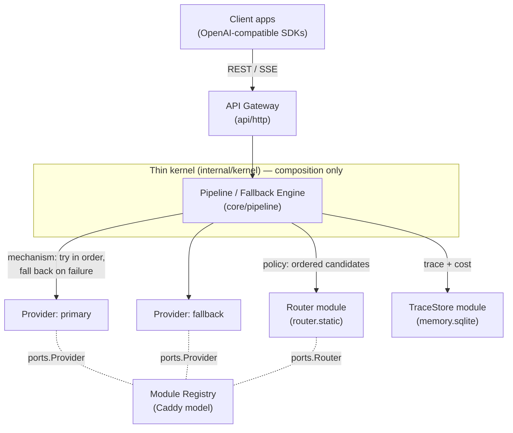

# Conductor

> An open-source, portable AI orchestration runtime — the *Docker/Kubernetes of AI orchestration*.

Applications talk to Conductor. Conductor talks to AI. It owns **orchestration**
(routing, fallback, streaming, observability) — never your business logic.

This repository is the **MVP walking skeleton**: a single static binary that
exposes an OpenAI-compatible API, routes each request through an ordered list of
provider modules, **automatically fails over** on error/timeout, streams the
response, and records a per-request trace with token/cost accounting.

---

## Why Conductor

| Pain | Conductor's answer |
|---|---|
| Vendor lock-in, different APIs | One OpenAI-compatible endpoint over many providers behind a stable contract |
| Heavy frameworks, runtime zoo | A single static binary — no Python/Node, no CGO, cross-compiles everywhere |
| No fallback when a provider is down | Automatic, ordered failover with every attempt recorded |
| Poor observability / cost blindness | Every request is a trace: attempts, tokens, latency, and cost |
| Rigid, monolithic cores | A **thin kernel + plugin modules** (the Caddy model) |

---

## Architecture

Hexagonal: the kernel and domain depend only on **ports** (interfaces in
[`core/ports`](core/ports)). Every provider, store, router, and tool is a
swappable **module** (adapter) registered at compile time. Swapping a module —
or later moving one out-of-process over gRPC — never touches the kernel.



**Request lifecycle:** parse → `Router.Route()` returns ordered candidates →
engine attempts each under a timeout, falling back on failure → first success
streams back (SSE) → the whole story (attempts, tokens, cost, latency) is saved
as a trace.

The router owns **policy** (which providers, in what order); the engine owns
**mechanism** (calling them, timing out, failing over, accounting). Richer
routing (cost/latency-based) plugs in behind the same `ports.Router` contract
with zero engine changes.

### Layout

```
cmd/conductor/          Entrypoint + module build manifest (modules.go)
core/ports/             THE CONTRACTS: Provider, Router, TraceStore, PromptStore, Tool, Memory
core/pipeline/          Fallback engine + provider set (streaming & non-streaming)
api/http/               OpenAI-compatible gateway (REST + SSE), auth, tracing
internal/kernel/        Composition root: config → modules → pipeline → serve
internal/config/        YAML config with ${ENV} expansion
internal/registry/      Caddy-style compile-time module registry
internal/observability/ Structured logging + cost calculation
modules/providers/      mock, openai, ollama (+ shared openaicompat client)
modules/router/static/  Static-priority router
modules/memory/sqlite/  SQLite TraceStore + PromptStore (pure-Go, CGO-free)
```

---

## Quick start

### Prerequisites
Go 1.24+ (only to build; the output is a self-contained binary).

### Build

```bash
# Single static binary — no CGO, cross-compiles anywhere.
CGO_ENABLED=0 go build -o conductor ./cmd/conductor
```

### Run the keyless failover demo

The bundled [`config.example.yaml`](config.example.yaml) wires two **mock**
providers — the primary forced to fail — so failover, streaming, and trace
recording all run with **zero API keys**:

```bash
./conductor run --config config.example.yaml
```

In another terminal:

```bash
# Non-streaming: watch it fail over to the fallback provider.
curl -s localhost:8080/v1/chat/completions \
  -H 'Content-Type: application/json' \
  -d '{"model":"gpt-4o-mini","messages":[{"role":"user","content":"hello"}]}'

# Streaming (SSE):
curl -N localhost:8080/v1/chat/completions \
  -H 'Content-Type: application/json' \
  -d '{"model":"gpt-4o-mini","stream":true,"messages":[{"role":"user","content":"hi"}]}'
```

The response carries a `conductor.trace_id` (also in the `X-Conductor-Trace-Id`
header). Inspect the full attempt history:

```bash
curl -s localhost:8080/v1/traces/<trace_id>   # both attempts: primary error → fallback success
curl -s localhost:8080/v1/traces?limit=10     # recent traces
```

### Use real providers

Set an API key in the environment (never in the file) and reference it with
`${VAR}`:

```yaml
providers:
  - name: openai-primary
    use: providers.openai
    settings:
      api_key: ${OPENAI_API_KEY}
      models:
        - id: gpt-4o-mini
          context_window: 128000
          pricing: { input_per_1k: 0.00015, output_per_1k: 0.0006 }
  - name: ollama-local          # local-first fallback, fully offline
    use: providers.ollama
    settings:
      base_url: http://localhost:11434
      models:
        - id: llama3.2
          context_window: 8192

router:
  use: router.static
  settings: { order: [openai-primary, ollama-local] }
```

Point any OpenAI SDK at `http://localhost:8080/v1` — only the base URL changes.

---

## Configuration reference

| Section | Key | Meaning |
|---|---|---|
| `server` | `address` | Listen address (default `:8080`) |
| | `api_key` | Bearer token required on `/v1/*` when set (empty = keyless) |
| | `request_timeout` | Per-attempt timeout, seconds (default 120) |
| `providers[]` | `name` | Unique instance name (used by the router) |
| | `use` | Module ID: `providers.mock` / `providers.openai` / `providers.ollama` |
| | `settings` | Module-specific config (passed to the module verbatim) |
| `router` | `use` / `settings` | Routing module (default `router.static`, `order: [...]`) |
| `trace_store` | `use` / `settings` | Optional; `memory.sqlite` with `path` |

Environment overrides: `CONDUCTOR_ADDRESS`, `CONDUCTOR_API_KEY`. Any `${VAR}` in
the YAML is expanded from the environment at load time.

---

## Extending: write a module

A module is any type that registers itself and implements a port:

```go
func init() { registry.Register(&MyProvider{}) }

func (p *MyProvider) ConductorModule() ports.ModuleInfo {
    return ports.ModuleInfo{ID: "providers.mine", New: func() ports.Module { return &MyProvider{} }}
}
// ...implement ports.Provider (Capabilities, Generate, Stream), optionally
// Provision/Validate/Cleanup lifecycle hooks.
```

Add a blank import to [`cmd/conductor/modules.go`](cmd/conductor/modules.go) and
rebuild — that's the whole extension model (the `xcaddy` analogy). The kernel and
contracts are untouched.

---

## Tests

```bash
go test -race ./...        # unit + HTTP integration tests, race-checked
go test -cover ./...       # with coverage
```

Coverage focuses on the load-bearing paths: the fallback engine (both streaming
and non-streaming), routing policy, config loading/validation, cost accounting,
SQLite persistence, and the HTTP gateway (fallback, SSE, auth, error handling).

---

## Roadmap (from the PRD)

- **Now (MVP):** kernel, registry, OpenAI-compatible gateway, static router +
  **fallback**, mock/openai/ollama providers, SQLite traces, cost tracking.
- **Phase 2:** workflow (DAG) engine, scheduler, dashboard, more providers.
- **Phase 3:** enterprise auth (JWT/OAuth2/RBAC), Postgres/Redis, OpenTelemetry.
- **Phase 4:** multi-agent, gRPC/WASM runtime plugins, visual builder, distributed execution.

The `MemoryStore` and `Tool` ports are already defined so the contract is
complete; their implementations arrive in later phases.

## License

Open source (license TBD).
